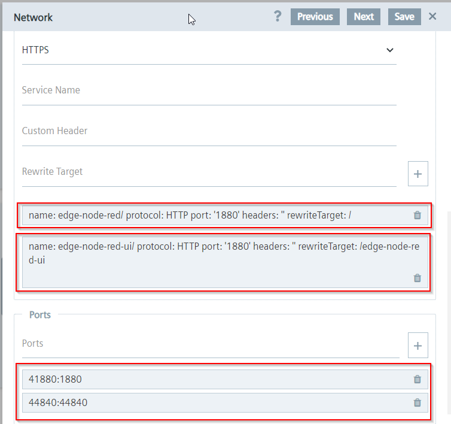

# edge-node-red

Node-RED Application for Industrial Edge with some of most used Node-RED Nodes preinstalled.

## Table of Contents

- [edge-node-red](#edge-node-red)
  - [Table of Contents](#table-of-contents)
  - [Requirements](#requirements)
    - [Used components](#used-components)
    - [Hardware Requirements](#hardware-requirements)
    - [Software requirements](#software-requirements)
  - [Installation](#installation)
    - [Download the application](#download-the-application)
    - [Import an application in .app format](#import-an-application-in-app-format)
    - [Create a new standalone application](#create-a-new-standalone-application)
      - [Setup volumes and reverse proxy](#setup-volumes-and-reverse-proxy)
    - [Upload the application to Industrial Edge Management](#upload-the-application-to-industrial-edge-management)
      - [Link your Industrial Edge App Publisher](#link-your-industrial-edge-app-publisher)
      - [Import a standalone application into Industrial Edge Management](#import-a-standalone-application-into-industrial-edge-management)
  - [Usage](#usage)
    - [Connecting to the Node RED Editor Page](#connecting-to-the-node-red-editor-page)
    - [Connecting to the Node RED Dashboards UI Page](#connecting-to-the-node-red-dashboards-ui-page)
  - [Build](#build)
    - [Extra Mapped Port for Additional Services](#extra-mapped-port-for-additional-services)
    - [Extra nodes in package.json](#extra-nodes-in-packagejson)
    - [Custom settings in settings.js](#custom-settings-in-settingsjs)
    - [`docker-compose.yml`](#docker-composeyml)
    - [`Dockerfile`](#dockerfile)
  - [References](#references)
  - [Contribution](#contribution)
  - [License & Legal Information](#license--legal-information)

## Requirements

### Used components

- OS: Windows or Linux
- Docker minimum V18.09
- Docker Compose V2.0 - V2.4
- Industrial Edge App Publisher (IEAP) V1.6.5
- Industrial Edge Management (IEM) V1.8.5
- Industrial Edge Device (IED) V1.8.0-6

### Hardware Requirements

The **edge-node-red** application is only compatible with SIEMENS devices that have Industrial Edge functionality enabled.

### Software requirements

The edge-node-red application needs a certain amount of RAM to run:

| Service Name  | Memory Limit |
| ------------- | ------------ |
| edge-node-red | 768 MB       |

> **Note:** This limit has been set for an average usage of node-red with dashboards, functions, data exchanging and other functions, but can be modified according to your needs by acting on the docker-compose file and then on the app configuration in the Edge App Publisher software, creating a custom version of this application.

## Installation

Below you will find the steps required to download the pre-compiled app or to create and install an edge app from the source code provided here.

You can either import a directly downloadable .app file below, or use the provided source code to build a new app from scratch.

Please refer to the [References](#references) section for detailed information on Industrial Edge application development.

### Download the application

The **edge-node-red** application can be downloaded in .app format using this secure Google Drive link:

- [edge-node-red_3.0.2.app](https://drive.google.com/file/d/1qq4rACKkZ9cMKIoEigDxe72Kh66FbCYh/view?usp=sharing)

### Import an application in .app format

- Open the **Industrial Edge App Publisher** software
- Import the `edge-node-red_3.0.2.app` file using the **Import** button
- The new imported application will appear in the **Standalone Applications** section

### Create a new standalone application

- Open the **Industrial Edge App Publisher** software
- Go to the **Standalone Applications** section and create a new application
- Import the [docker-compose](docker-compose.yml) file using the **Import YAML** button
- Click on **Review** and then on **Validate & Create**.

#### Setup volumes and reverse proxy

By importing the `docker-compose.yml` file in the Edge App Publisher some changes are applied in order to make the app compatible with the SIMATIC Edge environment:

- The `build` parameter is deleted since the image was already builded.
- In the **Storage** Section of the imported App a new volume for USB Media Mounting was added by using the pre-configured option.
- In the **Network** section of the imported App two Reverse Proxy endpoints was defined with following parameters:

  | Port | Type | Service Name     | Rewrite Target    |
  | ---- | ---- | ---------------- | ----------------- |
  | 1880 | HTTP | edge-node-red    | /                 |
  | 1880 | HTTP | edge-node-red-ui | /edge-node-red-ui |
  |      |      |                  |                   |



- The `mem_limit` parameter is added since is a mandatory field for SIMATIC Edge applications.

### Upload the application to Industrial Edge Management

Below is a brief description on how to publish your application to your IEM.

For more detailed information please see the official Industrial Edge GitHub guide to [uploading apps to the IEM](https://github.com/industrial-edge/upload-app-to-industrial-edge-management) and the [References](#references) section.

#### Link your Industrial Edge App Publisher

- Connect your Industrial Edge App Publisher to your **Docker Engine**
- Connect your Industrial Edge App Publisher to your **Industrial Edge Management**

#### Import a standalone application into Industrial Edge Management

- Create a new **Apps project** in the connected IEM or select an existing one
- Import the app version created in the **Standalone Applications** section into the selected IEM project
- Press **Start Upload** to transfer the application into Industrial Edge Management

## Usage

### Connecting to the Node RED Editor Page

You can access the Node RED Editor Web Interface by clicking on the _edge-node-red_ app icon in Edge Device Web Page or through endpoint.
The app has two endpoints configured:

- `https://<ied-address>/edge-node-red` : this endpoint open the Node-RED editor interface with HTTPS protocol. This is the default endpoint.
- `http://<ied-address>:41880` : this endpoint open the Node-RED editor interface.

To open the Node-RED editor a user must be logged.Below the default Login credentials:

- **user:** edge
- **password:** edge


> A user must be logged on Edge Device in order to open HTTPS endpoints. If no user is logged the endpoint URL will give Error 503 on load.

### Connecting to the Node RED Dashboards UI Page

You can access the Node RED Dashboards UI Web Interface by the two following endpoints:

- `https://<ied-address>/edge-node-red-ui` : this endpoint open the Node-RED Web Dashboard with HTTPS protocol.
- `http://<ied-address>:41880/edge-node-red-ui` : this endpoint open the Node-RED Web Dashboard.

> A user must be logged on Edge Device in order to open HTTPS endpoints. If no user is logged the endpoint URL will give Error 503 on load.

## Build

This App is based on the official [Node-RED Docker Image](https://hub.docker.com/r/nodered/node-red).
On Node-RED Documentation Website you can find more information on [How to Run Node-RED Docker](https://nodered.org/docs/getting-started/docker) and how to generate [Image Variation](https://nodered.org/docs/getting-started/docker#image-variations) for own customization.

### Extra Mapped Port for Additional Services

There is an additional port mapped through the [docker-compose.yml](docker-compose.yml) file that is the port **44840** that could be used for extra services and features that require a dedicated port like e.g. exposure of an OPCUA Server with `node-red-contrib-opcua` node.

### Extra nodes in package.json

Node-RED comes with a core set of useful nodes, but there are many more available from both the Node-RED project as well as the wider community.
You can search for available nodes in the [Node-RED library](https://flows.nodered.org/).

The [package.json](edge-node-red/package.json) file lists all the extra nodes installed in this Node-RED App:

```json
{
  ...
  ...
    "dependencies": {
        "node-red": "^3.0.2",
        "@mindconnect/node-red-contrib-mindconnect": "^3.12.1",
        "node-red-contrib-azureiothubnode": "^0.5.3",
        "node-red-contrib-influxdb": "^0.6.1",
        "node-red-contrib-mssql-plus": "^0.7.3",
        "node-red-node-mysql" : "^1.0.3",
        "node-red-contrib-postgres-variable": "^0.1.5",
        "net-keepalive": "^3.0.0",
        "node-red-contrib-s7comm": "^1.1.6",
        "node-red-contrib-s7": "^3.1.0",
        "node-red-contrib-opcua": "^0.2.289",
        "node-red-contrib-modbus": "^5.23.2",
        "node-red-contrib-cip-ethernet-ip" : "^1.1.3",
        "node-red-node-sqlite" : "^1.0.3",
        "node-red-contrib-spreadsheet-in" : "^0.6.0",
        "node-red-contrib-simple-message-queue": "^0.2.8",
        "node-red-contrib-soap": "^0.1.0",
        "node-red-contrib-string": "^1.0.0",
        "node-red-contrib-telegrambot": "^14.8.1",
        "node-red-node-email": "^1.18.1",
        "node-red-node-openweathermap": "^0.5.1",
        "node-red-node-ping": "^0.3.3",
        "node-red-node-random": "^0.4.1",
        "node-red-contrib-moment": "^4.0.0",
        "node-red-contrib-ui-led": "^0.4.11",
        "node-red-node-ui-table": "^0.4.3",
        "node-red-contrib-ui-level": "^0.1.46",
        "node-red-contrib-ui-media": "^2.0.0",
        "node-red-dashboard": "^3.2.0",
        "node-red-contrib-ui-svg" : "^2.3.1",
        "node-red-contrib-fs-ops": "^1.6.0",
        "node-red-contrib-fs": "^1.4.1",
        "node-red-contrib-smb": "1.2.0"
    }
}
```

You can also install nodes directly within the editor by selecting the `Manage Palette` option from the main menu to open the [Palette Manager](https://nodered.org/docs/user-guide/editor/palette/manager).

On Node-RED Documentation Website you can find more information on how to [Add nodes to the palette](https://nodered.org/docs/user-guide/runtime/adding-nodes).

### Custom settings in settings.js

The file [settings.js](edge-node-red/settings.js) contains the default settings for the Node-RED runtime. Below the settings changed from default values:

| Property | Default Value | Custom Value |
|----------|---------------|--------------|
| adminAuth | not used | `{ type: "credentials", users: [{ username: "edge", password: "<encrypted-password-goes-here>", permissions: "*" }]},`|
| apiMaxLength | `5mb` | `100mb` |
| httpStatic | not used | `/data/static/`|
| debugMaxLength | `1000` | `10000` |
| ui |`{ path: "ui" }` | `{ path: "edge-node-red-ui" }` |
| runtimeState |`{ enabled: false, ui: false }` | `{ enabled: true, ui: true }` |
| tours |`true` | `false` |

### `docker-compose.yml`

The Node-RED Docker base image used in this App is built using [docker-compose](https://docs.docker.com/compose/) tool with the command `docker-compose up -d --build` on the [docker-compose.yml](docker-compose.yml) file that will:

- creates the `edge-node-red` service container
- build our custom Node-RED Docker image using the file [Dockerfile](edge-node-red/Dockerfile) file and passing to it the argument **3.0.2** as the wanted `NODE_RED_VERSION` to be installed
- sets the timezone to `Europe/Rome`
- Maps the container port 1880 to the the host port **41880** (for Node-RED Web Interface)
- Maps the container port 44840 to the the host port **44840** (for extra features like e.g. exposure of an OPCUA Server with `node-red-contrib-opcua` node.)
- persists the `/data` dir inside the container to the`edge-node-red-data` volume in the Host System.
- map the `/media/simatic` folder for External Disks inside the container
- add `SYS_ADMIN` and `NET_ADMIN` capabilities.

### `Dockerfile`

In order to customize the Docker base image of this App, the file [Dockerfile](edge-node-red/Dockerfile) is used.

Taking the argument `NODE_RED_VERSION` passed by docker-compose file, docker start building process from node-red base image `nodered/node-red:<NODE_RED_VERSION>` and all files are copied to new docker image.
User and ui endpoint are set up in the [settings.js](edge-node-red/settings.js) file that is copied in this build phase.

The needed Linux packages are installed by `apk add` command, then all nodes are installed by `npm install` command.

Then the [start.sh](edge-node-red/start.sh) file is executed when the container is started. It will copy the settings and the flows file to the /data folder and then start Node-RED.

## References

- [Node-RED Library](https://flows.nodered.org/) - Official Node-RED Collection of Nodes and Example Flows.
- [Node-RED Documentation](https://nodered.org/docs/) - Node-RED Documentation Portal for every needs.
- [Node-RED Docker Image](https://hub.docker.com/r/nodered/node-red) - Official Node-RED Docker Image from Docker Hub.
- [Node-RED Docker Git](https://github.com/node-red/node-red-docker/tree/master) - Official Node-RED Docker Image Repository from GitHub.

You can find further documentation and help about Industrial Edge in the following links:

- [Industrial Edge Hub](https://iehub.eu1.edge.siemens.cloud/#/documentation)
- [Industrial Edge Forum](https://www.siemens.com/industrial-edge-forum)
- [Industrial Edge landing page](https://new.siemens.com/global/en/products/automation/topic-areas/industrial-edge/simatic-edge.html)
- [Industrial Edge GitHub page](https://github.com/industrial-edge)
- [Industrial Edge App Developer Guide](https://support.industry.siemens.com/cs/ww/en/view/109795865)

## Contribution

Thanks for your interest in contributing. Anybody is free to report bugs, unclear documentation, and other problems regarding this repository in the Issues section or, even better, is free to propose any changes to this repository using Merge Requests.

## License & Legal Information

Please read the [Legal Information](LICENSE.md).
